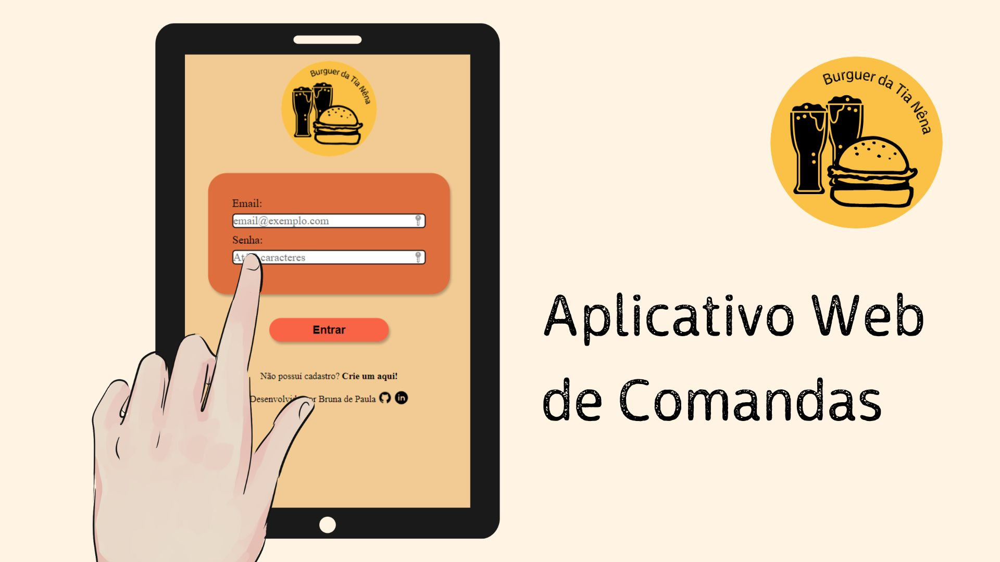

# Burguer da Tia Nêna 🚧

## Índice
* [Prefácio](#prefácio---cliente)
* [Resumo do projeto](#resumo-do-projeto)
* [Protótipo do Projeto](#protótipo-do-projeto)
* [Critérios de aceitação mínimos do projeto](#critérios-mínimos-de-aceitação-do-projeto)

***

## Prefácio - Cliente

Tia Nêna é dona de um pequeno *food truck*, e sempre anotou os pedidos no papel.   Certa vez, ao participar de um evento no bairro, a fila de espera chegou à **40min**, e muitas pessoas começaram a **desistir da compra**, preferindo outros *food trucks*.

> Tia Nêna gostaria de um sistema automatizado de comandas para ***otimizar*** o atendimento e ***agilizar*** o serviço.

Aqui você confere o projeto em sua fase atual: [🚧 Burguer da Tia Nêna 🚧](https://brulibra.github.io/sap007-burger-queen-api-client/)

## Resumo do projeto

Este projeto tem duas áreas: interface (cliente) e API (servidor). Nosso
cliente nos pediu para desenvolver uma interface que se integre com a API.

Estas são as informações que temos do cliente:

> Somos **Burguer da Tia Nêna** uma hamburgueria food truck.
>
>Nós temos 2 menus. Um muito simples para o café da manhã, e outro menu para o resto do dia.
>
> **Importante:** Os clientes podem escolher entre hambúrgueres de carne bovina,
> frango ou vegetariano. Além disso, por um adicional de R\$ 1,00 , eles podem
> adicionar queijo **ou** ovo.
>

A cliente também nos deu um [link da documentação](https://lab-api-bq.herokuapp.com/api-docs/) que especifica o comportamento esperado da API que iremos expor por HTTP.
Lá podemos encontrar todos os detalhes dos _endpoints_, como por exemplo
que parâmetros esperam, o que devem responder, etc.

O objetivo principal é construir uma _interface web_ usando o
_framework_ React. Esses framework front-end ataca
o seguinte problema: **como manter a interface e estado sincronizados**.

## Protótipo do Projeto

<!--  -->

### Não consegue ver o protótipo? [Clique aqui](https://www.figma.com/proto/wrNQKPYEAZp0CxiCHYf3hx/Prot%C3%B3tipo-Burger-Tia-N%C3%AAna?page-id=0%3A1&node-id=2%3A2&viewport=-271%2C431%2C0.51&scaling=scale-down&starting-point-node-id=2%3A2)

## Critérios mínimos de aceitação do projeto

### Definição do produto

O [_Product Owner_](https://www.youtube.com/watch?v=7lhnYbmovb4) nos apresentou
este _backlog_ que é o resultado do seu trabalho com o cliente até hoje.

***

> História de usuário 1: Garçom/Garçonete deve poder entrar no sistema

Eu, como garçom/garçonete quero entrar no sistema de pedidos.

#### Critérios de aceitação

- [x] Acessar uma tela de login.
- [x] Inserir email e senha.
- [x] Receber mensagens de erros compreensíveis, conforme o erro e as informações inseridas.
- [x] Entrar no sistema de pedidos caso as credenciais forem corretas.

***

> História de usuário 2: Garçom/Garçonete deve ser capaz de anotar o pedido do cliente

Eu como garçom/garçonete quero poder anotar o pedido de um cliente para não
depender da minha memória, saber quanto cobrar e poder enviar os pedidos para a
cozinha para serem preparados em ordem.

#### Critérios de aceitação

- [ ] Anotar o nome do cliente.
- [ ] Adicionar produtos aos pedidos.
- [ ] Excluir produtos.
- [ ] Ver resumo e o total da compra.
- [ ] Enviar o pedido para a cozinha (guardar em algum banco de dados).
- [x] Funcionar bem em um _tablet_.

***

> História de usuário 3: Chefe de cozinha deve ver os pedidos

Eu como chefe de cozinha quero ver os pedidos dos clientes em ordem, poder
marcar que estão prontos e poder notificar os garçons/garçonetes que o pedido
está pronto para ser entregue ao cliente.

#### Critérios de aceitação

- [ ] Ver os pedidos ordenados à medida em que são feitos.
- [ ] Marcar os pedidos que foram preparados e estão prontos para serem servidos.
- [ ] Ver o tempo que levou para preparar o pedido desde que chegou, até ser marcado
  como concluído.

***

> História de usuário 4: Garçom/Garçonete deve ver os pedidos prontos para servir

Eu como garçom/garçonete quero ver os pedidos que estão prontos para entregá-los
rapidamente aos clientes.

#### Critérios de aceitação

- [ ] Ver a lista de pedidos prontos para servir.
- [ ] Marcar os pedidos que foram entregues.

***
